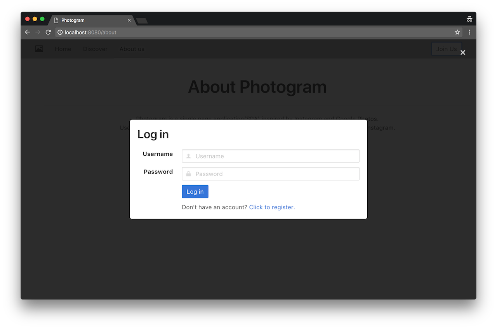
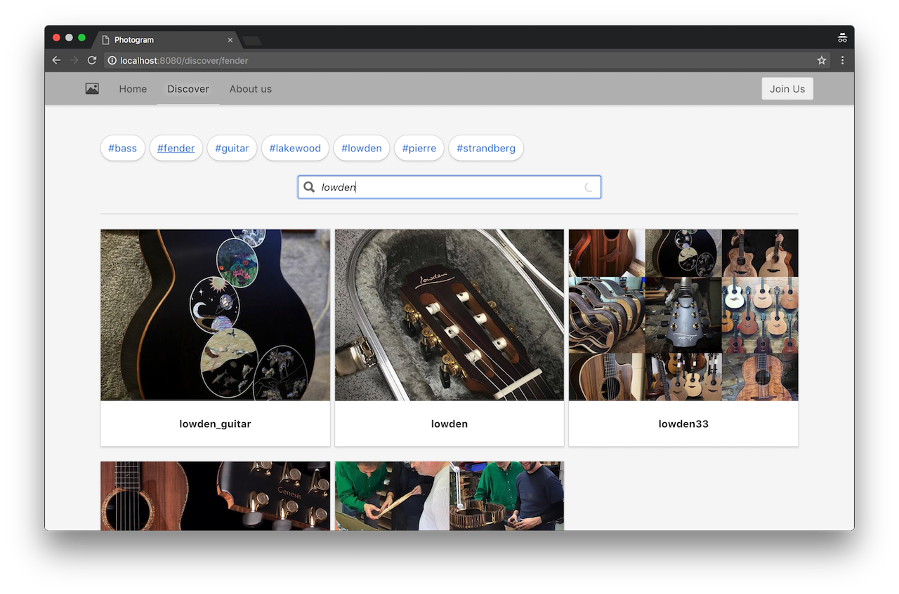
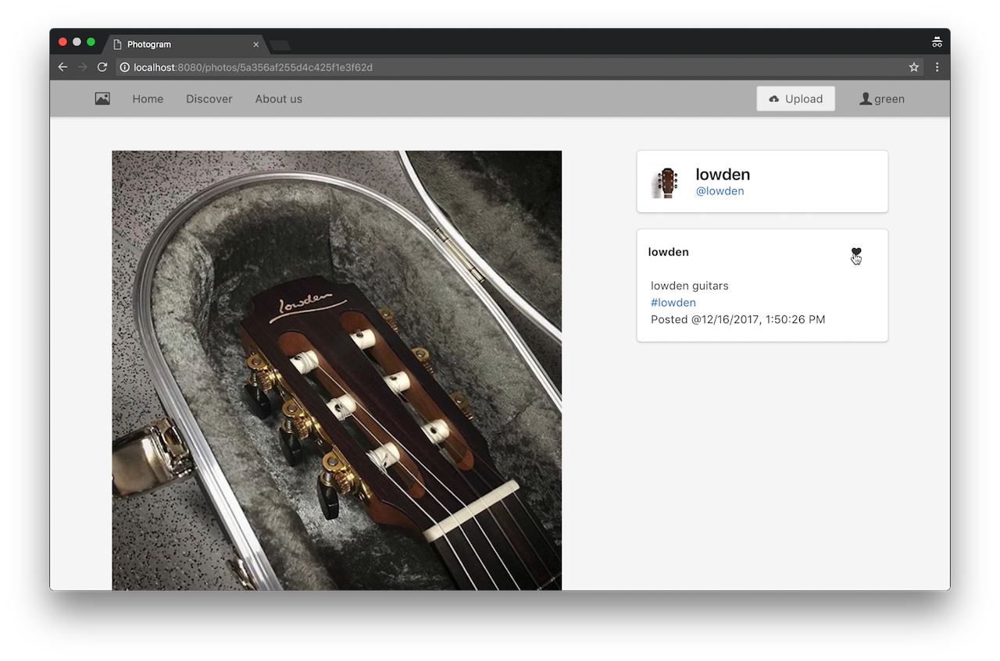
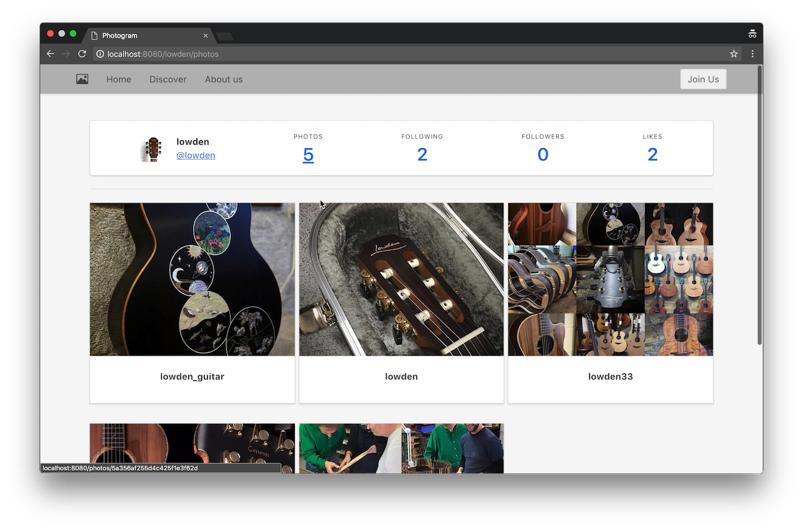
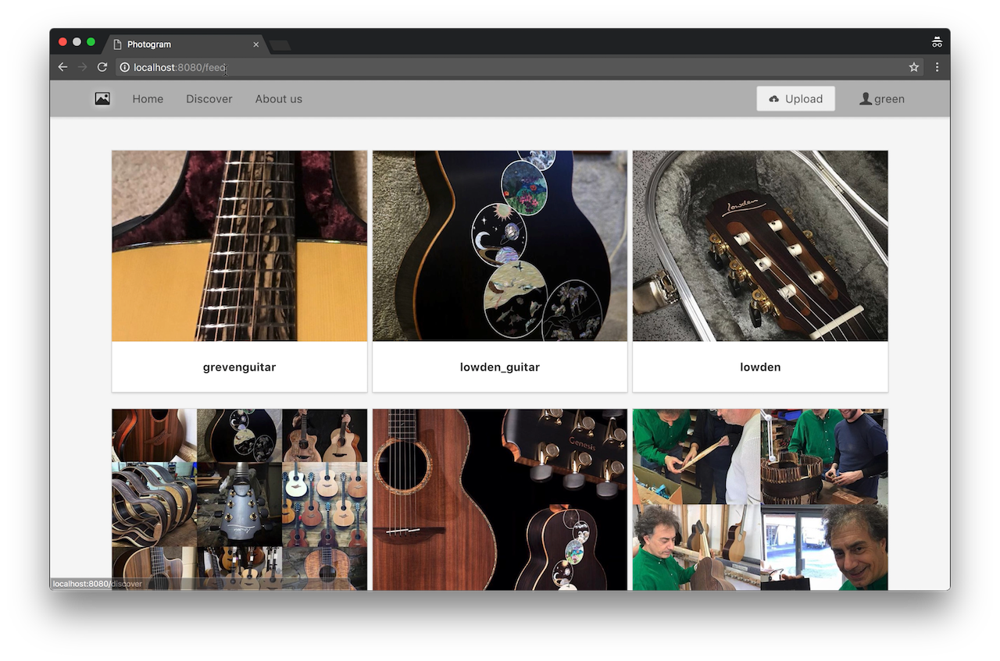
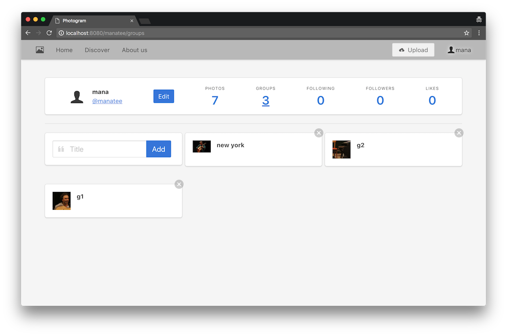
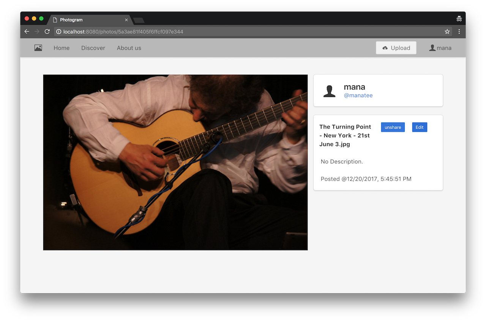
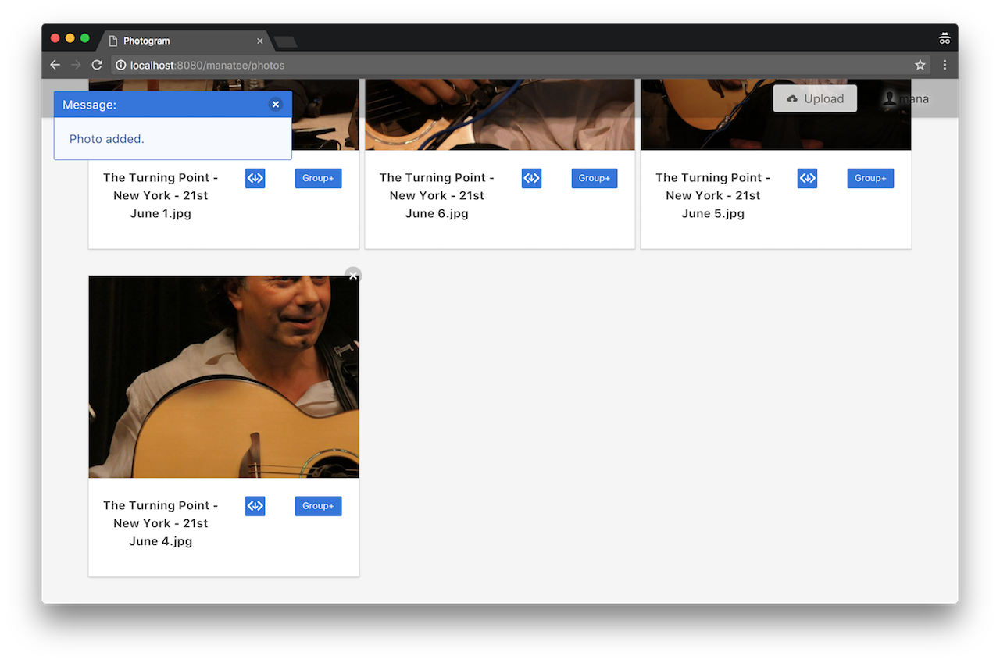
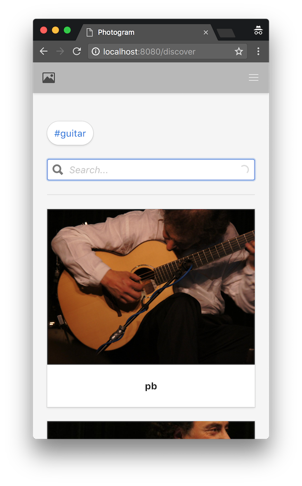

# Photogram
## About
Photogram is a single page application(SPA) inspired by Instagram and Google Photos. Users can upload and manage photo like in Google Photos, and share, like photos like in Instagram.

## Design
Photogram uses React/RX on the front-end, and a Node/Express back-end to serve up a REST-ful API. The app is rendered and controlled by frone-end React-Router, and interacts with Node with JSON APIs.

Server side Node/Express is designed in classical MVC architectural pattern. Client side React builts a unidirectional dataflow using RX.js, inspired by Redux. 
 
## Features
* UI responsive design, accessibility design
* User system, login/register/update profile
* Photo uploads/downloads and CRUD operations
* Photo groups/tags and CRUD operations
* Friend system, photo share/like and feed page
* Discover page, photo search by tag/keyword

## Todos
* front-end comments(back-end is done)
* SQL optimization
* Feed system optimation(use redis to cache)

## Usage
### production
#### 1.build client
```bash
cd client
yarn install
yarn run build
```
#### 2.start server
```bash
cd server
yarn install
yarn start
```
#### 3. visit localhost:3000

### development
#### 1.start client
```bash
cd server
yarn install
yarn run dev
```
#### 2.start server
```bash
cd client
yarn install
yarn run dev
```
#### 3. visit localhost:8080

## Screenshots
#### login/register


#### search photo


#### like photo


#### homepage(visitor)


#### feed(log in)


#### homepage(owner)


#### share/edit photo(owner)


#### group(owner)


#### responsive

